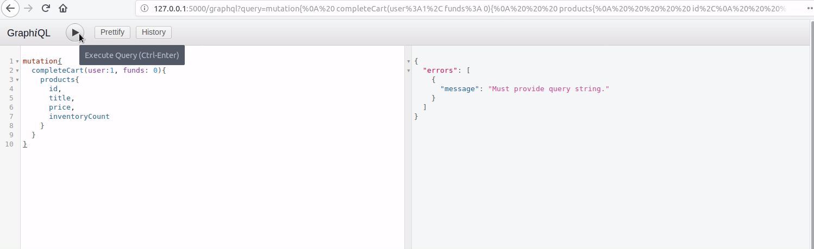

# Shoppr
Barebones online marketplace.

# Installation Guide
This application requires Python3 and MySQL to run.

It is recommended to run the code of this repository within a virtual environment.
To create one, simply run:
```
python3 -m venv venv
```

To activate it, run:
```
source venv/bin/activate
```

To install the required Python libraries, simply run:
```
pip3 install -r requirements.txt
```

Finally, to set up the database, run:
```
python3 setup.py
```

# Usage
To launch the application:
```
python3 app.py
```

It should run under `http://127.0.0.1:5000/`. The introduction page can be found here.

The application uses GraphQL, and has an interactive GraphiQL UI which can be found here: `http://127.0.0.1:5000/graphql`

Note that the functionalities have all been included as `mutations`. The GraphiQL docs describe sample usage for the various end-points.

# Demo

According to Murphy's Law, there is a chance you encounter difficulties setting the API up despite the provided walkthrough.
As such, below is a quick demo of the various functionalities exposed through this API, along with the GraphQL query to produce it.

## 1. Creating a product
This is exposed for administrative or debugging purposes. It simply adds products to the database.


## 2. Fetch all products
To view the status of the existing products, simply use this query. It comes with an optional parameter to ignore products which are out of stock (such as t-shirts, in this example).


## 3. Fetch one product
Similar to the previous point, but this time fetches information regarding a single product. Useful when our shop scales and we have too many items to fetch all of them every time.


## 4. Create cart
Creates a cart in which we will track our purchases. Only a single cart can exist for a given user, therefore new carts are rejected.


## 4. Add to cart
Adds an item to the cart, and returns the status of cart items. Note that adding the same item multiple times will result in a single cart item, but will increase the quantity requested by the new amount.


## 5. Complete cart
We are ready to purchase our two sunglasses, so we complete the cart. :tada:
Notice how we are unable to complete it if we have insufficient funds, and once the cart is completed it is also deleted.

